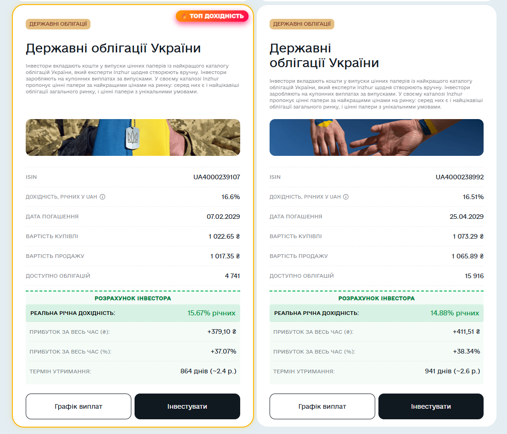

# 📈 Inzhur Smart Yield — Реальна дохідність ОВДП (Chrome Extension)

Неофіційне розширення для браузера Google Chrome, яке автоматично розраховує **реальну річну дохідність**, **чистий прибуток у ₴** та **загальний відсоток доходу** для облігацій (ОВДП) на платформі Inzhur.

Також розширення автоматично знаходить та підсвічує найбільш вигідну пропозицію плашкою **«🔥 ТОП ДОХІДНІСТЬ»**.

## 🚀 Як встановити (за 1 хвилину)

1. Завантажте останню версію архіву з розділу [Releases](../../releases) (файл `inzhur-calculator.zip`) або скачайте цей репозиторій архівом.
2. Розархівуйте завантажений `.zip` у будь-яку зручну папку на комп'ютері.
3. Відкрийте браузер Google Chrome та перейдіть за адресою: `chrome://extensions/`
4. У правому верхньому кутку увімкніть тумблер **«Режим розробника»** (*Developer mode*).
5. У лівому верхньому кутку натисніть кнопку **«Завантажити розпаковане»** (*Load unpacked*).
6. Виберіть папку, у яку ви розархівували файл.
7. Перейдіть на сайт Inzhur у розділ ОВДП та оновіть сторінку! 🎉

---

## 🛠 Можливості

- 🧮 **Розрахунок дохідності:** рахує реальний прибуток на основі графіка майбутніх купонів та вартості купівлі.
- 📅 **Точний термін:** враховує точну кількість днів до погашення.
- 🔥 **ТОП Дохідність:** порівнює всі картки на сторінці та виділяє найвигіднішу.
- 🎨 **Рідний дизайн:** органічно інтегрується в UI платформи Inzhur.

---

## 🔒 Безпека та приватність

Це **Open Source** проєкт. Розширення працює виключно локально у вашому браузері, не збирає, не зберігає та нікуди не передає ваші особисті дані або інформацію про баланси.
